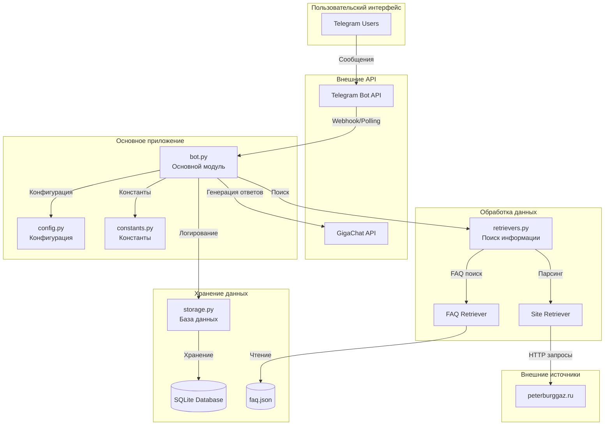
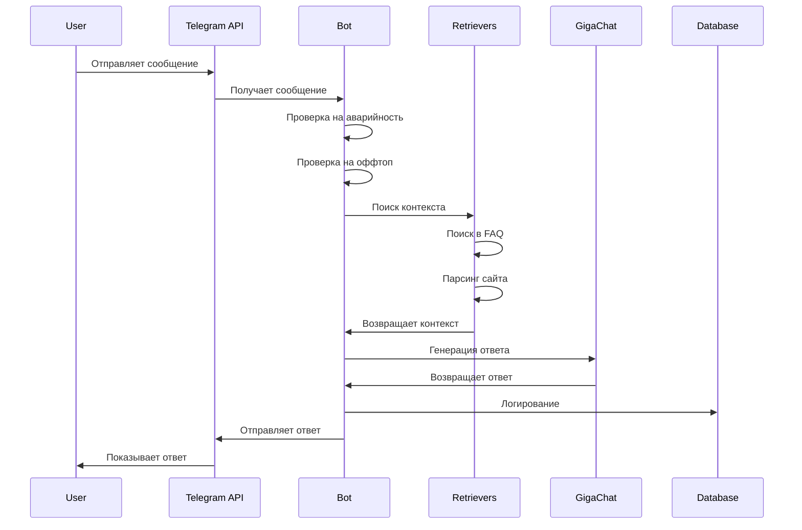
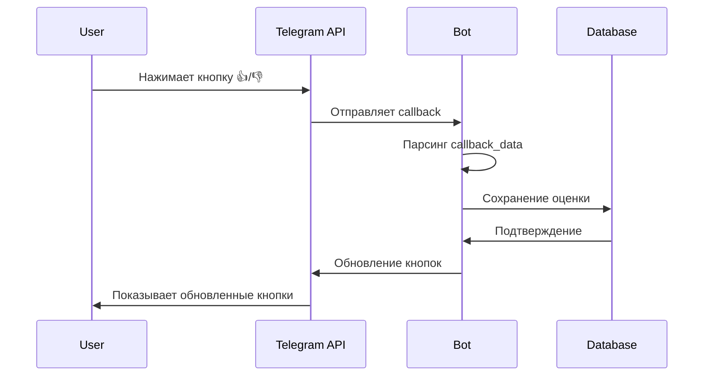

# Архитектура системы

## Обзор

Телеграм-бот «ПетербургГаз» построен по модульной архитектуре с четким разделением ответственности между компонентами.

## Диаграмма архитектуры



## Компоненты системы

### 1. Слой представления (Presentation Layer)

#### Telegram Bot API
- **Назначение:** Интерфейс взаимодействия с пользователями
- **Технология:** python-telegram-bot
- **Функции:**
  - Получение сообщений от пользователей
  - Отправка ответов
  - Обработка callback кнопок
  - Управление командами

### 2. Слой приложения (Application Layer)

#### bot.py - Основной модуль
- **Назначение:** Центральный контроллер приложения
- **Ответственность:**
  - Обработка входящих сообщений
  - Координация работы всех компонентов
  - Управление жизненным циклом бота
  - Обработка ошибок и исключений

**Основные классы:**
```python
class PetersburgGazBot:
    def __init__(self)
    def initialize(self)
    def handle_message(self, update, context)
    def handle_callback(self, update, context)
    def start_command(self, update, context)
    def stats_command(self, update, context)
    def _check_offtop(self, message)
    def _escape_markdown(self, text)
    def _split_message(self, text)
```

#### config.py - Конфигурация
- **Назначение:** Централизованное управление настройками
- **Ответственность:**
  - Загрузка переменных окружения
  - Валидация конфигурации
  - Предоставление настроек другим модулям

**Основные функции:**
```python
def load_config()
def validate_config()
def get_config_summary()
```

#### constants.py - Константы
- **Назначение:** Хранение всех констант и настроек
- **Ответственность:**
  - Ключевые слова для аварийных ситуаций
  - Ключевые слова для определения оффтопа
  - Настройки поиска и лимиты
  - Шаблоны сообщений и промптов

### 3. Слой бизнес-логики (Business Logic Layer)

#### Обработка сообщений
```python
def handle_message(self, update, context):
    # 1. Проверка на аварийность
    if self._check_emergency(message):
        return self._send_emergency_response()
    
    # 2. Проверка на оффтоп
    if self._check_offtop(message):
        return self._send_offtop_response()
    
    # 3. Поиск контекста
    context_data = self._build_context(message)
    
    # 4. Генерация ответа
    response = self._generate_response(message, context_data)
    
    # 5. Отправка ответа с кнопками оценки
    return self._send_response_with_rating(response)
```

#### Алгоритм определения оффтопа
```python
def _check_offtop(self, message):
    message_lower = message.lower()
    
    # Проверка на газовые термины (исключения)
    gas_terms = ['газ', 'газовый', 'газоснабжение', 'подключение']
    has_gas_terms = any(term in message_lower for term in gas_terms)
    
    # Проверка на оффтопные ключевые слова
    offtop_keywords = ['рецепт', 'готовить', 'пирог', 'медицина']
    has_offtop = any(keyword in message_lower for keyword in offtop_keywords)
    
    return has_offtop and not has_gas_terms
```

### 4. Слой доступа к данным (Data Access Layer)

#### retrievers.py - Поиск информации
- **Назначение:** Извлечение релевантной информации из различных источников
- **Компоненты:**
  - `FAQRetriever` - поиск в локальном FAQ
  - `SiteRetriever` - парсинг официального сайта

**Алгоритм поиска в FAQ:**
```python
class FAQRetriever:
    def search_faq(self, query, top_k=5, threshold=75.0):
        # 1. Fuzzy поиск с RapidFuzz
        fuzzy_results = self._fuzzy_search(query)
        
        # 2. Семантический поиск с TF-IDF
        semantic_results = self._semantic_search(query)
        
        # 3. Комбинирование результатов (70% fuzzy + 30% semantic)
        combined_results = self._combine_results(fuzzy_results, semantic_results)
        
        # 4. Фильтрация по порогу схожести
        filtered_results = [r for r in combined_results if r['score'] >= threshold]
        
        return filtered_results[:top_k]
```

**Алгоритм парсинга сайта:**
```python
class SiteRetriever:
    def search_site(self, query, top_k=3):
        # 1. Попытка использования встроенного поиска
        search_results = self._try_site_search(query)
        
        # 2. Обход основных страниц
        if not search_results:
            search_results = self._crawl_main_pages()
        
        # 3. Извлечение контента
        content_results = self._extract_content(search_results)
        
        # 4. Оценка релевантности
        scored_results = self._score_relevance(content_results, query)
        
        return scored_results[:top_k]
```

#### storage.py - База данных
- **Назначение:** Управление SQLite базой данных
- **Ответственность:**
  - Логирование взаимодействий
  - Хранение статистики
  - Управление пользователями

**Схема базы данных:**
```sql
-- Таблица пользователей
CREATE TABLE users (
    id INTEGER PRIMARY KEY,
    user_id INTEGER UNIQUE NOT NULL,
    username TEXT,
    first_name TEXT,
    last_name TEXT,
    created_at TIMESTAMP DEFAULT CURRENT_TIMESTAMP
);

-- Таблица сообщений
CREATE TABLE messages (
    id INTEGER PRIMARY KEY AUTOINCREMENT,
    user_id INTEGER NOT NULL,
    message TEXT NOT NULL,
    response TEXT NOT NULL,
    context_source TEXT,
    gigachat_used BOOLEAN DEFAULT FALSE,
    created_at TIMESTAMP DEFAULT CURRENT_TIMESTAMP,
    FOREIGN KEY (user_id) REFERENCES users (user_id)
);

-- Таблица оценок
CREATE TABLE ratings (
    id INTEGER PRIMARY KEY AUTOINCREMENT,
    message_id INTEGER NOT NULL,
    rating INTEGER NOT NULL CHECK (rating IN (0, 1)),
    created_at TIMESTAMP DEFAULT CURRENT_TIMESTAMP,
    FOREIGN KEY (message_id) REFERENCES messages (id)
);
```

### 5. Слой интеграции (Integration Layer)

#### gigachat_client.py - GigaChat API
- **Назначение:** Интеграция с GigaChat для генерации ответов
- **Технология:** OAuth 2.0 + REST API
- **Ответственность:**
  - Аутентификация
  - Генерация ответов
  - Управление токенами

**Алгоритм аутентификации:**
```python
class GigaChatClient:
    def _get_access_token(self):
        # 1. Подготовка Basic Auth
        credentials = f"{CLIENT_ID}:{CLIENT_SECRET}"
        encoded_credentials = base64.b64encode(credentials.encode()).decode()
        
        # 2. Запрос токена
        response = requests.post(
            "https://ngw.devices.sberbank.ru:9443/api/v2/oauth",
            headers={"Authorization": f"Basic {encoded_credentials}"},
            data="scope=GIGACHAT_API_PERS"
        )
        
        # 3. Сохранение токена
        token_data = response.json()
        self.access_token = token_data['access_token']
        self.token_expires_at = token_data['expires_at']
```

**Алгоритм генерации ответа:**
```python
def generate_answer(self, user_message, context=""):
    # 1. Формирование промпта
    system_prompt = SYSTEM_PROMPT_TEMPLATE.format(context=context)
    user_prompt = USER_PROMPT_TEMPLATE.format(
        question=user_message,
        context=context
    )
    
    # 2. Подготовка запроса
    payload = {
        "model": GIGACHAT_MODEL,
        "messages": [
            {"role": "system", "content": system_prompt},
            {"role": "user", "content": user_prompt}
        ],
        "temperature": 0.2,
        "max_tokens": 1000
    }
    
    # 3. Отправка запроса
    response = self._make_request("/chat/completions", payload)
    
    # 4. Извлечение ответа
    return response['choices'][0]['message']['content']
```

## Потоки данных

### 1. Поток обработки сообщения



### 2. Поток обработки callback



## Паттерны проектирования

### 1. Singleton
- **Применение:** `DatabaseManager` - единственный экземпляр для работы с БД
- **Преимущества:** Гарантирует единую точку доступа к базе данных

### 2. Strategy
- **Применение:** Различные стратегии поиска (`FAQRetriever`, `SiteRetriever`)
- **Преимущества:** Легко добавлять новые источники информации

### 3. Template Method
- **Применение:** Алгоритм обработки сообщений в `handle_message()`
- **Преимущества:** Четкая структура обработки с возможностью переопределения

### 4. Observer
- **Применение:** Логирование всех событий в базу данных
- **Преимущества:** Централизованное отслеживание активности

## Принципы архитектуры

### 1. Разделение ответственности (SRP)
- Каждый модуль отвечает за одну область функциональности
- `bot.py` - обработка сообщений
- `storage.py` - работа с БД
- `gigachat_client.py` - интеграция с GigaChat

### 2. Открытость/закрытость (OCP)
- Система открыта для расширения, закрыта для модификации
- Легко добавлять новые источники информации
- Легко добавлять новые команды

### 3. Инверсия зависимостей (DIP)
- Высокоуровневые модули не зависят от низкоуровневых
- Использование интерфейсов и абстракций
- Внедрение зависимостей через конструкторы

### 4. Единственная ответственность
- Каждый класс имеет одну причину для изменения
- Четкое разделение между бизнес-логикой и инфраструктурой

## Масштабируемость

### 1. Горизонтальное масштабирование
- Запуск нескольких экземпляров бота
- Использование общей базы данных (PostgreSQL)
- Load balancer для распределения нагрузки

### 2. Вертикальное масштабирование
- Увеличение ресурсов сервера
- Оптимизация алгоритмов поиска
- Кэширование результатов

### 3. Кэширование
- Кэширование результатов поиска в FAQ
- Кэширование токенов GigaChat
- Кэширование парсинга сайта

## Безопасность

### 1. Аутентификация и авторизация
- OAuth 2.0 для GigaChat API
- Проверка прав администратора для команды `/stats`
- Валидация всех входящих данных

### 2. Защита данных
- Параметризованные SQL запросы
- Экранирование специальных символов
- Хранение секретов в переменных окружения

### 3. Ограничения доступа
- Ограничение парсинга только доменом peterburggaz.ru
- Таймауты для всех внешних запросов
- Лимиты на использование API

## Мониторинг и наблюдаемость

### 1. Логирование
- Структурированные логи с контекстом
- Различные уровни логирования (DEBUG, INFO, WARNING, ERROR)
- Централизованное логирование

### 2. Метрики
- Количество обработанных сообщений
- Время ответа
- Использование токенов GigaChat
- Статистика по источникам ответов

### 3. Алерты
- Мониторинг доступности бота
- Алерты на критические ошибки
- Мониторинг использования ресурсов

## Заключение

Архитектура системы спроектирована с учетом принципов SOLID, обеспечивает высокую масштабируемость, безопасность и наблюдаемость. Модульная структура позволяет легко добавлять новую функциональность и поддерживать систему в долгосрочной перспективе.
